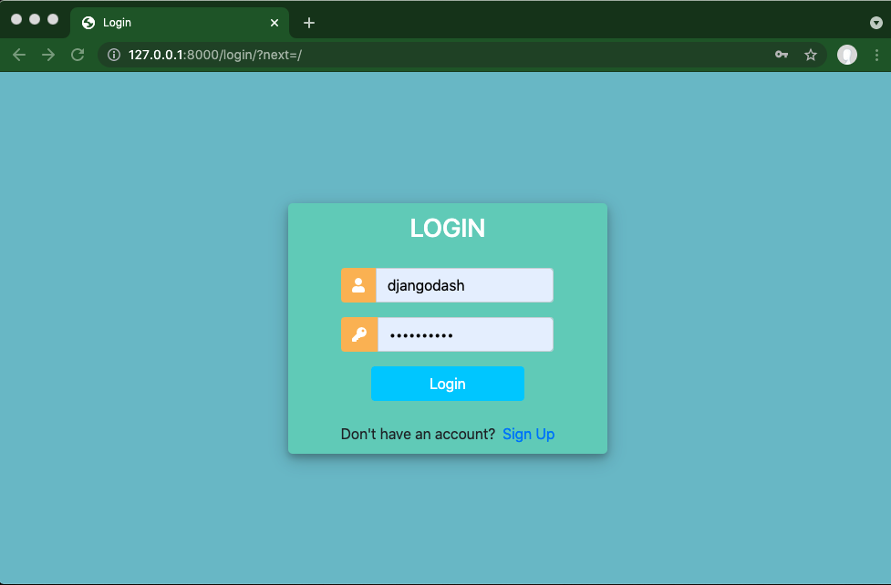
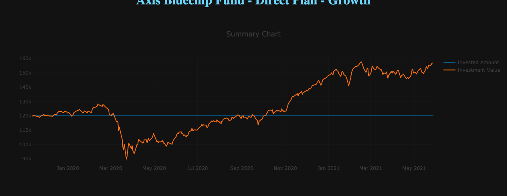
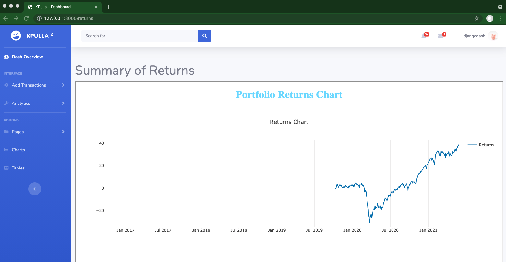
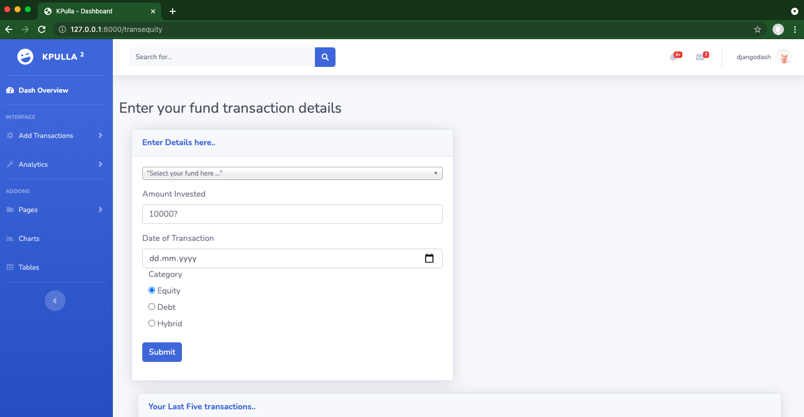

# KPulla
Financial portfolio website. Developed in specific for Indian Mutual funds tracking and analysis. Developed in Django-Python
Quandl is used as data source for obtaining the past information of funds. Ensure you get a an API key by registering in Quandl website and pass it on to source.py.

### GETTING STARTED

  - Install requirements pip install -r requirements.txt

### CREATE SUPERUSER
  - python manage.py create superuser

  Give your desired login credentials

  - Runserver on port 8000    python manage.py runserver 8000

### How to Use
  - navigate to transactions page to add your transactions from the list provided.
  - Refresh home page to see the plots delivered in the home page
  - Navigate to returns page to compare ther returns % of each unique fund in your transactions.
  
  
  
  
  
  
  
  
  
  
  
